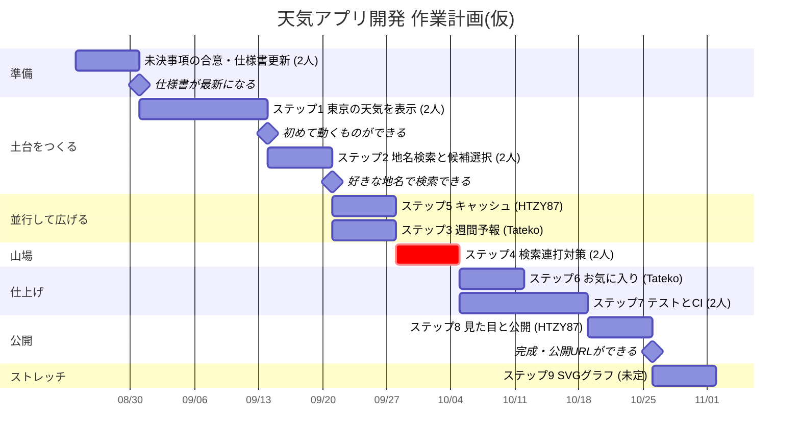

# 作業計画(WBS)

Issue #4〜#13 を、2人が並行して動ける形に並べた**仮の**計画です。

> **日付について**
> 「1 Issue ≒ 1週間」として仮に置いています(8/5からの実績が、だいたい週1本のPRペースだったため)。
> 締め切りではなく、**次に何をやればいいか迷わないため**の目安として使ってください。早ければ詰める、遅れれば伸ばす前提です。

## 担当

| | 担当 | 主に触るファイル |
|---|---|---|
| @HTZY87 | データ担当 | `api.js` |
| @Tateko | 表示担当 | `index.html` / `style.css` / `app.js` |

**W8・W9のあいだで役割を交代します。** 後半は @HTZY87 が表示側、@Tateko がデータ側に入れ替わり、2人とも両方を経験する形にします。

## ガントチャート

## 週ごとの内訳

| 週 | Issue | 内容 | @HTZY87 | @Tateko |
|---|---|---|---|---|
| W1 | [#4](../../issues/4) | 未決事項の合意・仕様書更新 | ● | ● |
| W2〜W3 | [#5](../../issues/5) | ステップ1 東京の天気を表示 | `getWeather()` を実装 | ダミーデータで画面を先に組む |
| W4 | [#6](../../issues/6) | ステップ2 地名検索と候補選択 | `searchCities()` を実装 | 検索欄と候補一覧UI |
| W5 | [#9](../../issues/9) / [#7](../../issues/7) | **並行** | #9 キャッシュ | #7 週間予報 |
| W6 | [#8](../../issues/8) | ステップ4 検索連打対策(山場) | ● | ● |
| W7 | [#11](../../issues/11) / [#10](../../issues/10) | **並行** | #11 テストを前倒しで着手 | #10 お気に入り |
| W8 | [#11](../../issues/11) | ステップ7 GitHub Actions設定 | ● | ● |
| ↕ | | **ここで役割を交代** | → 表示側へ | → データ側へ |
| W9 | [#12](../../issues/12) | ステップ8 見た目とPages公開 | ● | レビューと動作確認 |
| W10 | [#13](../../issues/13) | ステップ9 SVGグラフ(ストレッチ) | 未定 | 未定 |

## この計画の読み方

- **W5 と W7 が並行のキモです。** 触るファイルが違うので、お互いの完了を待たずに進められます。ここで待ち合わせてしまうと、片方が手持ち無沙汰になります。
- **#5 だけ2週間**取っています。最初はローカルサーバーの立ち上げなどでつまずきやすいためです。慣れれば1週間で回るはずです。
- **#8 は一緒にやる価値が一番高い**ところです。ここだけは予定を合わせて時間を取ってください。まず対策なしの状態で、開発者ツールのSlow 3Gでバグを再現してから直すと理解が深まります。
- **遅れても問題ありません。** 順番を変えたくなったら、各Issueの「前提」欄を書き換えれば大丈夫です。#11(テスト)はもっと早く始めても構いません。

## 節目

| いつ | 何ができているか |
|---|---|
| W3の終わり | ブラウザに東京の天気が出る ← 初めての「動くもの」 |
| W4の終わり | 好きな地名で検索できる |
| W9の終わり | 公開URLができ、誰でも見られる ← 完成 |
